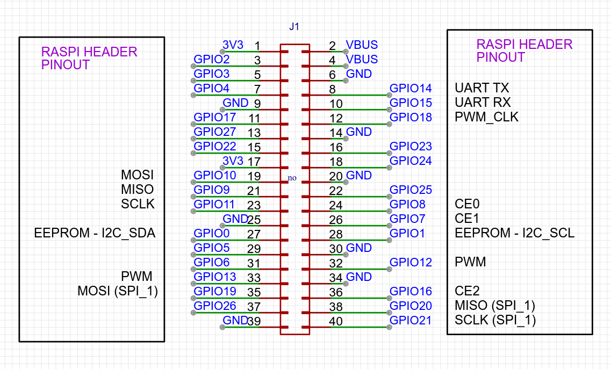

# rp2040-pHAT

Easy to use rp2040 development board.

# header pinout

# ADC pinout
The two header pins near the reset + boot switches provide two additional ADC breakout ports.
GPIO 28 + GPIO 29

*all gpio pins on the rp2040 are available*

# using with Raspberry Pi
In order to upload code to the raspberry pi you will need to solder the solder-jumpers on the back of the board.
There are 4 solder jumpers on the back, these allow SWD + UART communication directly between the rp2040 and the raspberry pi host system.

see the install_sdk.sh, bash script
running that script on the raspberry pi, will setup the pi to allow SWD programming via OpenOCD

You can also manual step thru the commands, just open the file and copy-n-paste the lines manually.

# example code
This board is 100% compatible with all rasberry pi pico examples.
See https://github.com/raspberrypi/pico-examples

# more examples
there will be more examples available
One neat example code allows using the rp2040-pHAT as an SPI Slave to the raspberry pi board.
